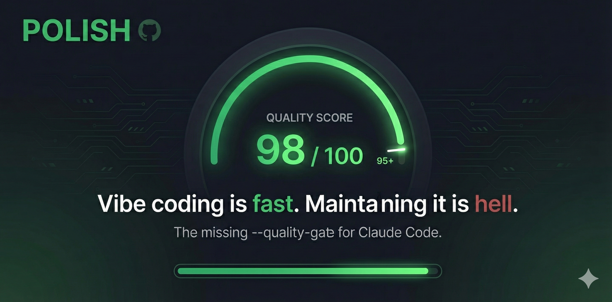

# Polish - The missing Claude Code Command

When Planning was introduced to Claude code it changed the way we used the tool. But now, even thought you have Skills, Agents and all there is still a piece missing. 
<div align="center">

</div>

## The Problem

Vibe coding is fast. Maintaining it is hell.

AI-generated code looks great on day one. After a month? Bugs, spaghetti, no tests. Each fix breaks something else.

## The Solution

Polish is a hook that keeps Claude working until your code hits 95%+ quality. The loop:

1. **Measure** - Run lint, types, tests, coverage
2. **Identify** - Find the worst metric
3. **Fix** - Claude makes one atomic change
4. **Validate** - Check if it improved
5. **Repeat** - Until score >= 95%

It runs all the tests that you never run and more ;) 

## Get Started

```bash
npm install -g polish-cli
polish init
polish hook install
```

That's it. Now when Claude tries to stop, Polish checks your metrics first.

## Adding Checks

```bash
polish add typescript
polish add lint
polish add build
```

See all available checks: `polish bank list`

## Configuration

Polish creates a `polish.config.json`:

```json
{
  "metrics": [
    { "name": "tests", "command": "npm test", "weight": 100, "target": 100 },
    { "name": "typescript", "command": "npx tsc --noEmit", "weight": 100, "target": 100 },
    { "name": "lint", "command": "npx eslint .", "weight": 80, "target": 95 }
  ],
  "target": 95
}
```

- **weight** - How much this metric matters in the final score
- **target** - Minimum score for this metric (0-100)

## License

MIT
